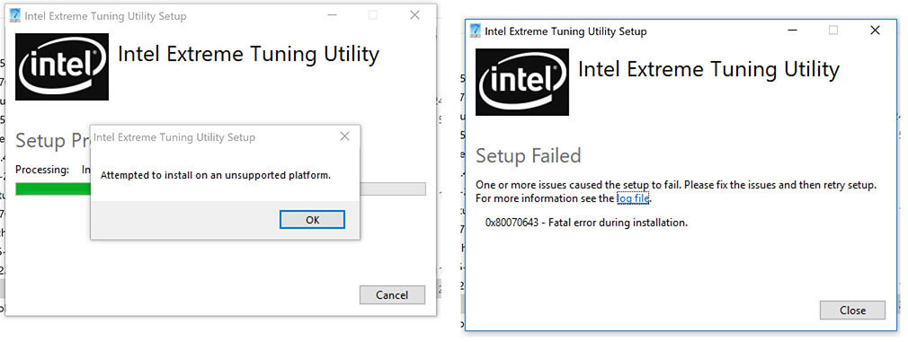
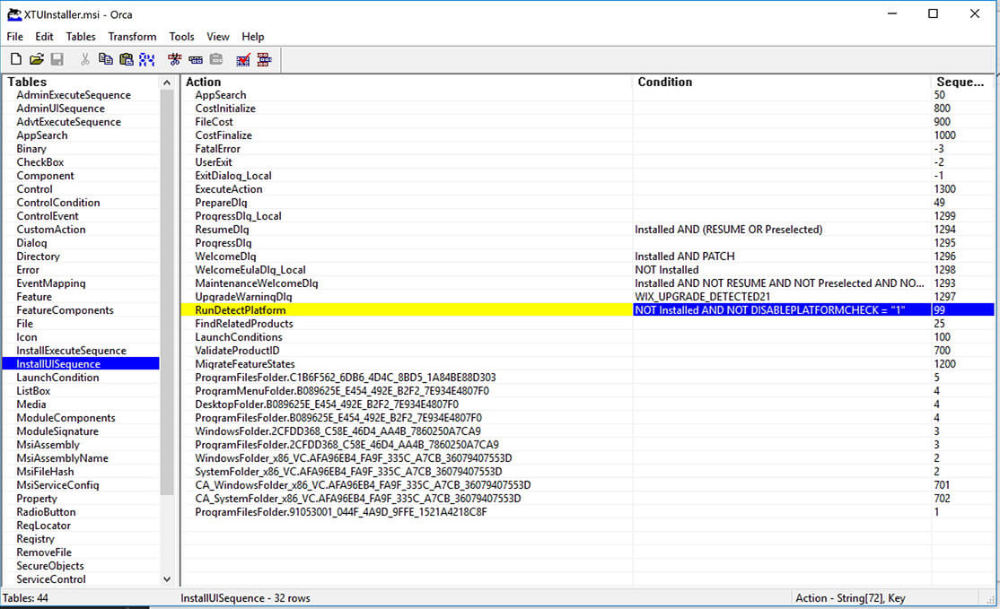

> I noticed this old post still getting some traffic. Most probably due to old links in forums and blogs.\
> \
> The original post was written back in 2018, as such I have no idea if this workaround still works _probably not_, but I've revived the content below.\
> Do try downloading and installing the latest version of [Intel XTU](https://www.intel.com/content/www/us/en/download/17881/intel-extreme-tuning-utility-intel-xtu.html) first.

With a new 8th gen i7 laptop on hand, undervolting the CPU got brought up to increase the CPU turbo/performance, battery life, and fan curve. There seems to be 3 ways of doing this, [Intel XTU](https://www.intel.com/content/www/us/en/search.html?ws=idsa-default#q=intel%20xtu&sort=relevancy&f:@tabfilter=[Downloads]), [ThrottleStop](https://www.techpowerup.com/download/techpowerup-throttlestop/), and natively in BIOS.\
I’ll leave you figure out how the software and solutions work in your own pace – [link](https://bradshacks.com/matebook-x-pro-throttling/).

The issue at hand however is that the newer, _as of writing_, version 6.4.1.25 of Intel XTU is not supporting my laptop anymore, throwing error **'0x80070643', 'attempted to install on an unsupported platform'** during the setup.



## Workaround

Run the .exe and extract the **.msi** installer from your `%temp%` folder.\
Run the .msi while passing the `DISABLEPLATFORMCHECK=1` property.

```powershell
## Run .exe installer
Start-Process -FilePath "C:\Users\Username\Downloads\XTUSetup.exe"
## Proceed until error message on screen - Don't exit!
# Copy the .msi version of the installer package from %Programdata%\Package Cache\ location
Copy-Item -Path "C:\ProgramData\Package Cache\{275588D7-6C9D-4FB0-BBAE-2FA3F7C2DADB}v6.4.1.25\XTUInstaller.msi" -Destination "C:\Users\Username\Downloads\XTUInstaller.msi"
## Exit the .exe installer
# Run the .msi version of the installer setting the DISABLEPLATFORMCHECK property to '1'
Start-Process -FilePath "msiexec.exe" -ArgumentList "/i C:\Users\Username\Downloads\XTUInstaller.msi DISABLEPLATFORMCHECK=1"
```

Due to the nature of this workaround, use at your own risk, and all that!

## Show your work

Starting on the task of undervolting the CPU in my Huawei Matebook X Pro quickly got me to [Intel XTU](https://www.intel.com/content/www/us/en/search.html?ws=idsa-default#q=intel%20xtu&sort=relevancy&f:@tabfilter=[Downloads]) and [ThrottleStop](https://www.techpowerup.com/download/techpowerup-throttlestop/) via the likes of [/r/MatebookXPro](https://www.reddit.com/r/MatebookXPro/). I decided to go for XTU mainly due to the fact that I’ve previously had contact with the software.
With the success stories over on [/r/MatebookXPro](https://www.reddit.com/r/MatebookXPro/) and other places on the internet I knew that XTU was _Supposed_ to work, as such, a generic 'unsupported platform' error has be solvable, to have a solution or workaround, and it must be found!

Software installs usually logs something to somewhere, XTU not only logs, but kindly points you to the file in the error.
Reading through the log provides a bit of information on how the process works, the lines of interest to finding the more malleable .msi version of the install however looks something like so:

```text {data-label="Intel_Extreme_Tuning_Utility_20181206220727.log" data-line="5"}
[3954:3EA0][2018-12-06T22:08:07]i370: Session begin, registration key: SOFTWARE\Microsoft\Windows\CurrentVersion\Uninstall\{6a0def1c-f6f2-4a5d-81f6-a1b858352c8b}, options: 0x7, disable resume: No
[3954:3EA0][2018-12-06T22:08:07]i000: Caching bundle from: 'C:\Users\Username\AppData\Local\Temp\{121CF5FA-9A1A-42B2-837C-618F7F34F73D}\.be\XTUSetup.exe' to: 'C:\ProgramData\Package Cache\{6a0def1c-f6f2-4a5d-81f6-a1b858352c8b}\XTUSetup.exe'
[3954:3EA0][2018-12-06T22:08:08]i320: Registering bundle dependency provider: {6a0def1c-f6f2-4a5d-81f6-a1b858352c8b}, version: 6.4.1.25
[3954:3EA0][2018-12-06T22:08:08]i371: Updating session, registration key: SOFTWARE\Microsoft\Windows\CurrentVersion\Uninstall\{6a0def1c-f6f2-4a5d-81f6-a1b858352c8b}, resume: Active, restart initiated: No, disable resume: No
[3954:47BC][2018-12-06T22:08:09]i305: Verified acquired payload: XTUInstaller.msi at path: C:\ProgramData\Package Cache\.unverified\XTUInstaller.msi, moving to: C:\ProgramData\Package Cache\{275588D7-6C9D-4FB0-BBAE-2FA3F7C2DADB}v6.4.1.25\XTUInstaller.msi.
[3954:3EA0][2018-12-06T22:08:09]i323: Registering package dependency provider: {275588D7-6C9D-4FB0-BBAE-2FA3F7C2DADB}, version: 6.4.1.25, package: XTUInstaller.msi
[3954:3EA0][2018-12-06T22:08:09]i301: Applying execute package: XTUInstaller.msi, action: Install, path: C:\ProgramData\Package Cache\{275588D7-6C9D-4FB0-BBAE-2FA3F7C2DADB}v6.4.1.25\XTUInstaller.msi, arguments: ' ARPSYSTEMCOMPONENT="1" MSIFASTINSTALL="7" REMOVEALLAPPDATA=""'
[3954:3EA0][2018-12-06T22:09:33]e000: Error 0x80070643: Failed to install MSI package.
[3954:3EA0][2018-12-06T22:09:33]e000: Error 0x80070643: Failed to execute MSI package.
[476C:243C][2018-12-06T22:09:33]e000: Error 0x80070643: Failed to configure per-machine MSI package.
[476C:243C][2018-12-06T22:09:33]i319: Applied execute package: XTUInstaller.msi, result: 0x80070643, restart: None
[476C:243C][2018-12-06T22:09:33]e000: Error 0x80070643: Failed to execute MSI package.
```

Note the _GUID {}_ in the log.\
Navigate to the `C:\ProgramData\Package Cache\{275588D7-6C9D-4FB0-BBAE-2FA3F7C2DADB}v6.4.1.25\` folder and copy the XTUInstaller.msi file to any new location, C:\XTU for example, save this for later.

Taking it one more step on the logging front, located in the `%temp%` directory, another .log file shows up, Intel_Extreme_Tuning_Utility_20181206220727_000_XTUInstaller.msi.log.\
Having a read, some very promising lines start showing up:

```text {data-label="Intel_Extreme_Tuning_Utility_20181206220727_000_XTUInstaller.msi.log" data-line="1"}
Action start 22:08:09: RunDetectPlatform.
DetectPlatform: Found unsupported device 9D21
DetectPlatform: Found unsupported device 5914
DetectPlatform: Found unsupported device 9D60
DetectPlatform: Found unsupported device 9D14
```

So, we’re looking to run the **XTUInstaller.msi** installer, but not only that, we’d need it to **skip** the **RunDetectPlatform** section.

The way you run .msi files from commandline is using the msiexec command, [link](https://docs.microsoft.com/en-us/windows/desktop/msi/command-line-options).\
Point `msiexec` to the .msi file using the /i flag, `msiexec /i XTUInstaller.msi` follow that with the PROPERTY=value, `msiexec /i XTUInstaller.msi DISABLEPLATFORMCHECK=1`.

Where did we get the **DISABLEPLATFORMCHECK** property and value from?\
Using [OrcaMSI](https://docs.microsoft.com/en-us/windows/desktop/msi/orca-exe) I was able to take a look within the .msi finding out that **RunDetectPlatform** runs on a condition, setting **DISABLEPLATFORMCHECK** to **1** skips the whole thing.



One more thing to note is that XTU runs on Microsoft SQL Server Compact 4.0, in case of more errors, a manual update to SP1 could do wonders.
